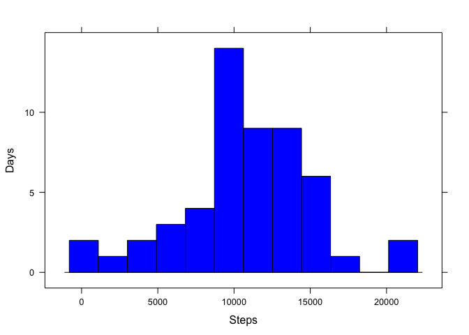
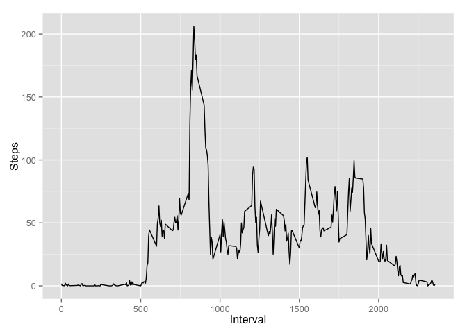
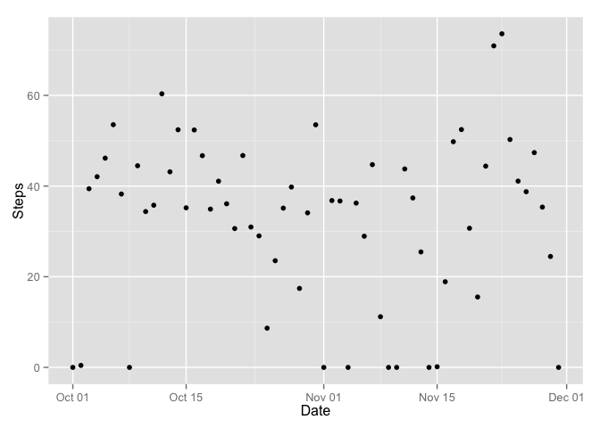
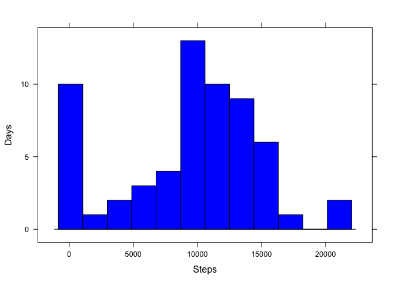
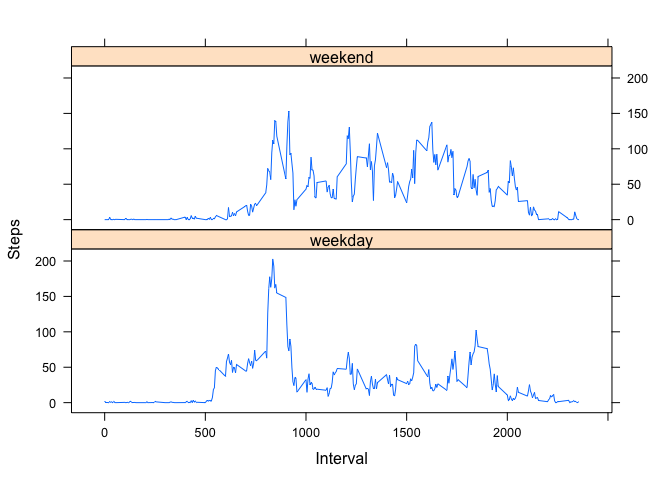

# Reproducible Research: Peer Assessment 1
 <br />
 <br />
 
### Introduction  
*Purpose: This document highlights using R markdown by integrating a simple R coding example with its explanation.*

A few packages are required to run the code in this example. Both the 'lattice' and the 'ggplot2' 
packages are used for learning sake. The code for importing the libraries is shown below.


```r
library(ggplot2)
library(lattice)
```
 <br />
 
### Loading and preprocessing the data
Before the data can be loaded a few variables need to be set. First the R working directory is defined and set. The other 
paths defined in this script will be relative to this directory. For your own installation you will need to change the path variable to paoint to your own working directory.

```r
working_dir <- '~/projects/CourseraDataScience/projects/reproducible_research/project_1/'
setwd(working_dir)
```
<br />
Next the path to the raw data is set. The zipped data is included in this project, but the unzipped version is not. To properly run this script you will need to unzip the data to the same relative path. Once this is done the data is imported from the csv file. The date column is then transformed from a factor variable to a date variable for later processing.

```r
path <- './raw_data/activity.csv'
imported_data <- read.csv(path)
imported_data$date <- as.Date(imported_data$date, format = "%Y-%m-%d")
```
<br />
<br />

### What is mean total number of steps taken per day?
First it is illustrative to get an idea of how many steps are taken every day. This will help you understand the general trend of the data. To calculate the mean number of steps per day the aggregate function along with the sum function is used. This creates a data frame with the total number of steps for each day. Once this is done the columns are renamed to a human readable format.

```r
total_steps_per_day <- aggregate(imported_data$steps ~ imported_data$date, imported_data, sum)
colnames(total_steps_per_day)[1] <- 'date'
colnames(total_steps_per_day)[2] <- 'steps'
```

To better visualize this information a histogram of the number of steps is plotted. For this step the 'lattice' plotting package is used.

```r
histogram(~steps, data = total_steps_per_day, xlab='Steps', ylab='Days', type='count', col='blue', nint=12)
```

 

To get a better grasp of the day both the mean and the median can also be calculated. The mean number of steps taken per day can easily be found with the mean function.

```r
mean(total_steps_per_day$steps)
```

```
## [1] 10766
```

The median number of steps taken per day can also easily be found with the with its correspsonding median function. As can be seen from these two values the mean and median are very close to each other.

```r
median(total_steps_per_day$steps)
```

```
## [1] 10765
```

<br />
<br />

### What is the average daily activity pattern?
Next, it is best to drill down into the data and visualize when most of the steps are taken during a typical day. This can be done by finding the mean steps across all days for a certain time interval. This is accomplished in the code below by using the aggregate function once again, but this time with the mean function. The data returned from the aggregate function is a data frame and as before the columns are renamed into a more human readable format.

```r
mean_steps_per_interval <- aggregate(imported_data$steps ~ imported_data$interval, imported_data, mean)
colnames(mean_steps_per_interval )[1] <- 'interval'
colnames(mean_steps_per_interval )[2] <- 'steps'
```


As before, it is better to visualize this information with a plot instead of a raw data frame. In this example the 'ggplot2' package is utilized to show the mean number of steps taken per the interval in the day.

```r
qplot(interval, steps, data=mean_steps_per_interval, geom="line", xlab='Interval', ylab='Steps')
```

 

The max number of steps per interval can be found on the graph at around roughly the 800 interval but it is best found with the max function.

```r
max(mean_steps_per_interval$steps)
```

```
## [1] 206.2
```

<br />
<br />

### Inputing missing values
Although the results obtained above are fairly accurate they ignore the fact that some of the data is unknown. First lets see how many step values are unknown or NA in the data.

```r
sum( is.na(imported_data$steps) )
```

```
## [1] 2304
```
Now lets devise a strategy to cope with the missing values. First we will copy the data in to a new data frame to work on.

```r
filtered_data <- imported_data
```
Next, lets devise our strategy to fill in the missing values. Our strategy will be simple and use the mean value for the day to fill any any missing values. To do this we need to calculate the mean value for each day. There is one problem with this. The problem is that some days have no mean value because all of the values are missing. We will cope with this by creating a new column that has a zero for every NA and the standard step value when there is one.

```r
filtered_data$steps_mean <- filtered_data$steps
filtered_data$steps_mean[is.na(filtered_data$steps_mean)] <- 0
```
Next we will use the aggregate and mean functions as before to create a new data frame that has the mean step values for each of the days. As before we will add better column names to the data frame once it is created.

```r
mean_steps_per_date <- aggregate(filtered_data$steps_mean ~ filtered_data$date, filtered_data, mean)
colnames(mean_steps_per_date)[1] <- 'date'
colnames(mean_steps_per_date)[2] <- 'steps'
```
Now that we have the mean step value for every day lets plot the data to get a feel for what it looks like.

```r
qplot(date, steps, data=mean_steps_per_date, xlab='Date', ylab='Steps')
```

 
  
The final step is to iterate over the new data frame created and if the step value is NA to find the mean value for this day and insert it into the step value.

```r
for(i in seq(1:length(filtered_data$steps)))
{
    if( is.na(filtered_data[i, 1]) )
    {
        date_on <- filtered_data[i,2]
        mean_steps_row <- mean_steps_per_date[mean_steps_per_date$date == date_on, ]
        filtered_data$steps[i] <- mean_steps_row$steps
    }
}
```
Since we changed our data lets rerun our initial analysis on the new data. First lets look at the histogram of the total number of steps taken each day. The calculation can be found below.

```r
total_steps_per_day <- aggregate(filtered_data$steps ~ filtered_data$date, filtered_data, sum)
colnames(total_steps_per_day)[1] <- 'date'
colnames(total_steps_per_day)[2] <- 'steps'
```
The histogram for this data is shown below and can be compared with the previous histogram. The data looks very similar except for the big spike at zero. This is likely caused by many days that had no data and hence a zero mean filled in for the NA.

```r
histogram(~steps, data = total_steps_per_day, xlab='Steps', ylab='Days', type='count', col='blue', nint=12)
```

 

Because of the added zeros the mean is lower in the new data.

```r
mean(total_steps_per_day$steps)
```

```
## [1] 9354
```

The median is lower as well. The main difference is that the mean dropped more than the median did.

```r
median(total_steps_per_day$steps)
```

```
## [1] 10395
```
<br />
<br />

### Are there differences in activity patterns between weekdays and weekends?
Finally, we are going to compare the difference between weekdays and weekends. We start this analysis by computing the day of the week that the date maps to. After we know the day of the week we add another column that will define the sample as occcuring either on a weekday or a weekend. Once this is done the day type variable is cast as a factor for later use.

```r
filtered_data$day <- weekdays(filtered_data$date)
filtered_data$day_type <- ifelse(filtered_data$day == 'Saturday', 'weekend',
                                 ifelse(filtered_data$day =='Sunday', 'weekend', 'weekday'))
filtered_data$day_type <- factor(filtered_data$day_type)
```
Once the date is classified we split the data into two data sets based upon the day type.

```r
split_data <- split(filtered_data, filtered_data$day_type)
weekday_data <- split_data$weekday
weekend_data <- split_data$weekend
```
For the weekdays we calculate the mean number of steps per interval using the mean and aggregate functions. Once that is done the columns are renamed to something more readable. Finally, to finish this data frame a new column is added defining this data as a weekday.

```r
mean_weekday_steps_per_interval <- aggregate(weekday_data$steps ~ weekday_data$interval, weekday_data, mean)
colnames(mean_weekday_steps_per_interval)[1] <- 'interval'
colnames(mean_weekday_steps_per_interval)[2] <- 'steps'
mean_weekday_steps_per_interval$day_type <- 'weekday'
```
The same thing that is done for the weekdays is done for the weekends.

```r
mean_weekend_steps_per_interval <- aggregate(weekend_data$steps ~ weekend_data$interval, weekend_data, mean)
colnames(mean_weekend_steps_per_interval)[1] <- 'interval'
colnames(mean_weekend_steps_per_interval)[2] <- 'steps'
mean_weekend_steps_per_interval$day_type <- 'weekend'
```
Because we split up our data, we need to append the rows in the data frames so that we have one final data frame. From this final data frame we use the lattice plotting system to plot two graphs based upon the day type. From the graphs you can see a noticable difference between step activity on weekdays and weekends. On weekdays, the steps occur throughout the day. On weekends, a considerably larger amount of steps occur earlier in the interval. If the intervals correspond with time of day it could be surmised that on weekends there is considerable walking occuring in the morning followed by more inactivity in the afternoon and evening.

```r
merged_data <- rbind(mean_weekday_steps_per_interval, mean_weekend_steps_per_interval)
xyplot(merged_data$steps ~ merged_data$interval | merged_data$day_type, layout = c(1, 2), type='l', xlab='Interval', ylab="Steps")
```

 


